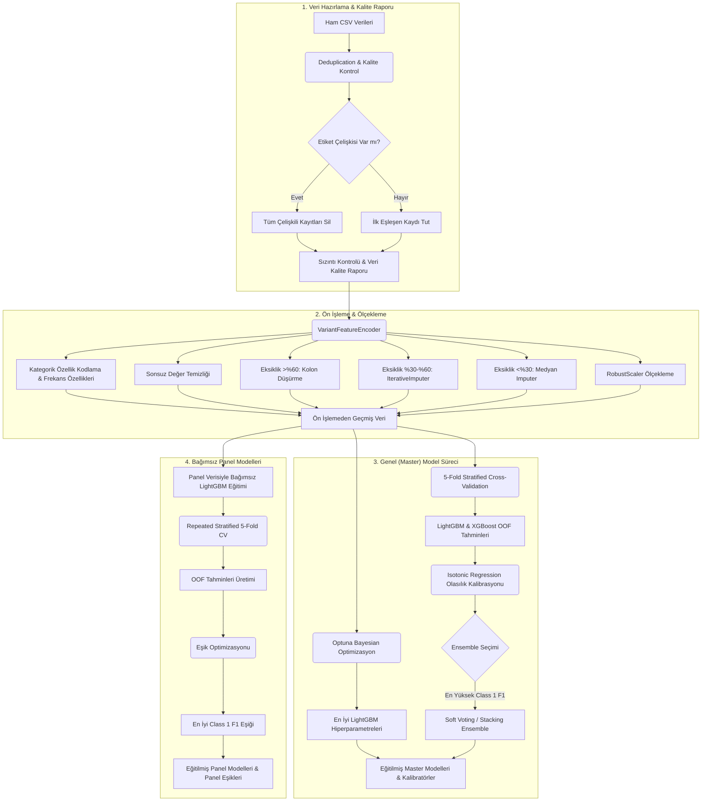

# PathGuard: Missense Genetik Varyant Sınıflandırma Sistemi

PathGuard, missense genetik varyantların patojenik/benign sınıflandırması için geliştirilmiş bir makine öğrenmesi pipeline'ıdır. Sistem; veri kalite kontrolü, sızıntı farkındalığı, LightGBM/XGBoost ensemble, Logistic Regression stacking, olasılık kalibrasyonu, patojenik sınıf (Class 1) F1'ini maksimize eden eşik seçimi, master modelinden bağımsız panel modelleri ve SHAP açıklanabilirliği içerir. Her panel (KANSER, PAH, CFTR) master modelinden tamamen bağımsız, yalnızca kendi verisiyle eğitilen ayrı bir modeldir (bkz. `docs/rapor_guncellemeleri.md`).

## Proje Yapısı

- `src/`: Veri yükleme, ön işleme, model wrapper'ları, pipeline, değerlendirme ve açıklanabilirlik kodları.
- `src/models/`: LightGBM, XGBoost, ensemble ve bağımsız panel modeli bileşenleri.
- `scripts/`: Eğitim ve tahmin CLI araçları.
- `data/raw/`: Yarışma eğitim CSV dosyaları.
- `models/`: Eğitim sonrası üretilen model artifact'leri. Git'e alınmaz.
- `outputs/`: Metrikler, veri kalite raporları, hata analizleri, feature importance, SHAP ve grafik çıktıları. Git'e alınmaz.
- `docs/`: Yarışma şartnamesi ve proje raporu.

## Kurulum

**Windows (PowerShell):**

```powershell
py -m venv venv
.\venv\Scripts\Activate.ps1
pip install -r requirements.txt
```

**Linux / macOS:**

```bash
python3 -m venv venv
source venv/bin/activate
pip install -r requirements.txt
```

**Conda:**

```bash
conda env create -f environment.yml
conda activate pathguard
```

macOS kullanıyorsanız LightGBM için `libomp` gerekebilir:

```bash
brew install libomp
```

## Eğitim

Tam eğitim:

```bash
python scripts/train.py --trials 30
```

Hızlı smoke test:

```bash
python scripts/train.py --trials 1 --cv-repeats 1 --skip-shap
```

CLI seçenekleri:

- `--trials`: Master LightGBM için Optuna deneme sayısı.
- `--cv-repeats`: Küçük panel OOF validasyonu için repeated stratified CV tekrar sayısı. Varsayılan `10`.
- `--calibration-mode`: `oof` veya `holdout`. Varsayılan `oof`.
- `--enable-stacking` / `--no-enable-stacking`: Logistic Regression stacking katmanını açar/kapatır. Varsayılan açık.
- `--skip-shap`: SHAP üretimini atlar, hızlı doğrulama için kullanılır.

## Tahmin

Master model ile:

```bash
python scripts/predict.py data/raw/TEST_FILE.csv --panel MASTER --output submission.csv
```

Panel modeli ile:

```bash
python scripts/predict.py data/raw/CFTR_TEST.csv --panel CFTR --output cftr_submission.csv
```

Girdi CSV'si eğitimde öğrenilen feature şemasıyla uyumlu olmalıdır. Eksik veya fazla kolon varsa tahmin script'i açık hata mesajı verir.

## Üretilen Çıktılar

Eğitim sonunda başlıca çıktılar şunlardır:

- `outputs/data_quality_report.json`: Satır sayıları, sınıf dağılımları, missing oranları, duplicate/çelişkili duplicate bilgisi ve master-panel örtüşmeleri.
- `outputs/experiment_log.jsonl`: Eğitim olayları, Optuna sonucu ve metrik kayıtları.
- `outputs/master_metrics.json`: Master OOF metrikleri.
- `outputs/panel_*_metrics.json`: Panel OOF metrikleri.
- `outputs/master_ensemble_comparison.json`: Soft voting ve logistic stacking karşılaştırması.
- `outputs/error_analysis_*.csv`: FP/FN örnekleri.
- `outputs/feature_importance_*.csv`: Gain ve permutation importance raporları.
- `outputs/*_pr_curve.png`, `outputs/*_reliability.png`: PR ve kalibrasyon grafikleri.
- `outputs/*_shap_summary.png`, `outputs/*_shap_waterfall_*.png`: Açıklanabilirlik grafikleri.
- `models/*.joblib`: Encoder, base modeller, kalibratörler, seçilen ensemble meta bilgisi ve panel modelleri.

## Sistem Akışı ve Mimarisi

Sistemin uçtan uca veri akışı ve mimarisi aşağıdaki gibidir:



### Detaylı Adımlar

1. **Veri kalite kontrolü:** Eğitim setleri yüklenir; boş veri, eksik hedef, tek sınıf, duplicate ve çelişkili duplicate kontrolleri yapılır.
2. **Sızıntı farkındalığı:** Panel `Variant_ID` değerlerinin master set ile örtüşmesi raporlanır. Örtüşme varsa panel metrikleri `Leakage_Aware=true` olarak işaretlenir.
3. **Ön işleme:** Kategorik kolonlar missing/rare/unseen güvenli encoding ve frequency encoding'den geçer. Sürekli sayısal özellikler için eksiklik oranına göre imputasyon (%30 altı medyan, %30-%60 arası IterativeImputer, %60 üstü kolon düşürme) ve tüm sürekli özellikler için RobustScaler ölçekleme uygulanır.
4. **Master model:** LightGBM için Optuna ile PR-AUC optimizasyonu yapılır. LightGBM ve XGBoost OOF tahminleri kalibre edilir.
5. **Ensemble seçimi:** Soft voting ve Logistic Regression stacking OOF metrikleriyle karşılaştırılır; patojenik sınıf F1 skoru (Class 1 F1) yüksek olan seçilir.
6. **Eşik seçimi:** Karar eşiği, OOF tahminleri üzerinde patojenik sınıf F1 (Class 1 F1) maksimize edilerek seçilir; klinik recall kısıtı uygulanmaz (`CLINICAL_RECALL_TARGET = 0.0`).
7. **Panel modelleri:** KANSER, PAH ve CFTR panelleri master modelinden **bağımsız** olarak, yalnızca kendi panel verileriyle ayrı LightGBM modelleri biçiminde eğitilir (master soft prediction meta-feature kullanılmaz). Panel metrikleri final train-set üzerinden değil, repeated stratified OOF tahminlerden hesaplanır.
8. **Analiz çıktıları:** Metrikler, hata analizi, feature importance, reliability diagram ve SHAP grafikleri üretilir.

## Son Eğitim Özeti

`python scripts/train.py --trials 30` çalıştırması (Python 3.14, bağımsız panel mimarisi). Seçilen master ensemble: `soft_voting`.

| Model | Class 1 F1 | PR-AUC | Sensitivity | Specificity |
| --- | ---: | ---: | ---: | ---: |
| Master OOF | 0.8916 | 0.9230 | — | — |
| KANSER OOF | 0.9043 | — | 0.9623 | — |
| PAH OOF | 0.9245 | — | 0.9967 | — |
| CFTR OOF | 0.9290 | — | 0.9444 | — |

Panel metrikleri bağımsız (sızıntısız) eğitimden elde edilmiştir; eski meta-learning değerlerinden (0.92–0.95) **beklenen şekilde düşüktür** — bu dürüst/gerçekçi OOF skorunu yansıtır. Ayrıntı için `docs/rapor_guncellemeleri.md`.

## Notlar

- Modeller ve çıktılar bilinçli olarak Git dışında tutulur.
- Dış veri kaynaklarından etiket sorgulama yapılmaz; yarışma kısıtına uygun biçimde yalnız verilen varyant profilleri kullanılır.
- Eşik seçimi yalnızca patojenik sınıf F1'ini (yarışma metriği) maksimize eder; klinik recall kısıtı uygulanmaz.
- Paneller master modelinden bağımsızdır; bu sayede master-panel örtüşmesinden kaynaklanan yanıltıcı (sızıntılı) OOF F1 ortadan kalkar ve raporlanan panel skorları görülmemiş test verisini daha dürüst yansıtır.

---

**Takım:** MEN-INA | **Proje:** PathGuard
