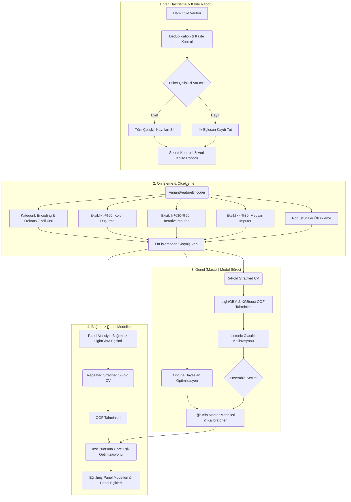

# PathGuard: Missense Genetik Varyant Sınıflandırma Sistemi

Missense genetik varyantları **Patojenik / Benign** olarak sınıflandıran bir makine öğrenmesi pipeline'ı. Dört bağımsız model üretir: **Master (Genel)**, **KANSER**, **PAH**, **CFTR**. Her panel master modelinden tamamen bağımsız, yalnızca kendi verisiyle eğitilir.

## Kurulum (Windows / PowerShell)

**Gereksinim:** Python 3.11+ (3.14'te test edildi). Sürümü kontrol: `py --version`.

```powershell
# 1) Repoyu klonla ve içine gir
git clone https://github.com/MEN-INA/pathGuard.git
cd pathGuard

# 2) Sanal ortam (venv) oluştur — proje klasörü içinde "venv" adında
py -m venv venv

# 3) venv'i aktive et (her yeni PowerShell oturumunda tekrar gerekir)
.\venv\Scripts\Activate.ps1

# 4) Bağımlılıkları kur (sabitlenmiş sürümler)
pip install -r requirements.txt
```

Aktivasyon başarılıysa satır başında `(venv)` görünür. `venv` klasörü Git'e gönderilmez; herkes kendi bilgisayarında bu adımları çalıştırarak kendi ortamını kurar — bu yüzden arkadaşın da aynı `requirements.txt` ile birebir aynı sürümleri elde eder.

### Sorun Giderme

- **`source: command not found` / `venv/bin/activate` çalışmıyor:** Bunlar Linux/macOS komutudur. Windows PowerShell'de aktivasyon: `.\venv\Scripts\Activate.ps1`.
- **`python` tanınmıyor ama `py` çalışıyor:** Windows'ta normaldir; Python launcher'ı `py`'dir. Bu repodaki tüm komutlar `py` kullanır. (venv aktifken `py` otomatik olarak venv'i kullanır.)
- **`Activate.ps1 ... çalıştırılamıyor (execution policy)`:** Bir kez şunu çalıştır: `Set-ExecutionPolicy -Scope CurrentUser RemoteSigned` ve tekrar dene.
- **Alternatif (her zaman çalışır):** Aktivasyonla uğraşmadan venv python'unu doğrudan çağır: `.\venv\Scripts\python.exe scripts/train.py --trials 1 --cv-repeats 1 --skip-shap`

## Eğitim

```powershell
# Hızlı smoke test (~20 sn)
py scripts/train.py --trials 1 --cv-repeats 1 --skip-shap

# Tam eğitim (~2-3 dk)
py scripts/train.py --trials 30
```

## Tahmin

```powershell
# Master (Genel) model
py scripts/predict.py data/raw/TEST_FILE.csv --panel MASTER --submission-only --output submission.csv

# Panel modeli (KANSER | PAH | CFTR) — master ağırlığı gerektirmez
py scripts/predict.py data/raw/CFTR_TEST.csv --panel CFTR --submission-only --output cftr.csv
```

Girdi CSV'si eğitimdeki feature şemasıyla uyumlu olmalıdır; eksik/fazla kolonda script açık hata verir.

## Mimari



## Sonuçlar

`py scripts/train.py --trials 30` çalıştırması.

> **"Beklenen Test F1" nedir?** İki sütun da **aynı metriği** — patojenik sınıfın (class 1) F1'ini — gösterir; tek fark hangi sınıf dağılımında ölçüldüğüdür. Eğitim/OOF dağılımı ~%80 patojenik, **final test seti ise ~%20 patojeniktir** (Q&A). Yarışma skoru test setinde ölçüleceği için gerçek sıralama metriği **Beklenen Test F1** sütunudur. Recall ve specificity sınıf oranından bağımsız olduğundan bunları sabit tutup precision'ı test prior'unda (%20) yeniden hesaplarız. OOF F1 yalnızca referanstır (yanlış dağılımda olduğu için yüksek görünür).

| Model | OOF Class 1 F1 | **Beklenen Test F1** | Recall | Specificity | ROC-AUC |
| --- | ---: | ---: | ---: | ---: | ---: |
| Master | 0.7923 | **0.5951** | 0.6933 | 0.8408 | 0.8492 |
| KANSER | 0.7887 | **0.6455** | 0.6830 | 0.8917 | 0.8858 |
| PAH | 0.7880 | **0.4974** | 0.6840 | 0.7333 | 0.7636 |
| CFTR | 0.7413 | **0.7413** | 0.5889 | 1.0000 | 0.8905 |

Eşik, test prior'u (%20) altında class 1 F1'i maksimize edecek şekilde seçilir. PAH en zor panel (düşük ROC-AUC); CFTR en iyi (yanlış-pozitif yok → specificity 1.0, bu yüzden iki F1 eşit). Ayrıntı: `docs/rapor_guncellemeleri.md`.

## Notlar

- `models/` ve `outputs/` Git dışındadır (eğitimle üretilir).
- Dış veri kaynağından etiket sorgulanmaz; yalnızca verilen varyant profilleri kullanılır.
- Paneller master'dan bağımsızdır → master-panel örtüşmesinden kaynaklı yanıltıcı (sızıntılı) OOF F1 ortadan kalkar.

---

**Takım:** MEN-INA | **Proje:** PathGuard
